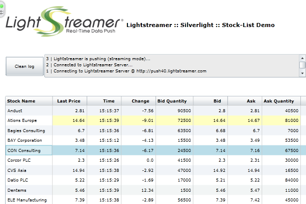

# Lightstreamer - Basic Stock-List Demo - Silverlight Client 

<!-- START DESCRIPTION lightstreamer-example-stocklist-client-silverlight -->

This project contains a simple Silverlight version of the [Lightstreamer - Stock-List Demos - HTML Clients](https://github.com/Weswit/Lightstreamer-example-Stocklist-client-javascript) fed through a Lightstreamer server.

## Live Demo

 
###[ View live demo](http://demos.lightstreamer.com/Silverlight_StockListDemo) 

## Details

This app uses the <b>Silverlight Client API for Lightstreamer</b> to handle the communications with Lightstreamer Server and uses a <b>Silverlight Grid</b> to display the real-time data pushed by Lightstreamer Server. 
After launching the demo, the Silverlight application will automatically connect to Lightstreamer Server and will subscribe to 30 stock quotes. 

A Silverlight Grid is used to display the real-time data. You can sort on any columns and drag the columns around (in this demo the resorting is not done automatically on each update).

<!-- END DESCRIPTION lightstreamer-example-stocklist-client-silverlight -->

## Install

If you want to install a version of this demo pointing to your local Lightstreamer Server, follow these steps:

* Note that, as prerequisite, the [Lightstreamer - Stock- List Demo - Java Adapter](https://github.com/Weswit/Lightstreamer-example-Stocklist-adapter-java) has to be deployed on your local Lightstreamer Server instance. Please check out that project and follow the installation instructions provided with it.
* Launch Lightstreamer Server.
* Download the `deploy.zip` file that you can find in the [deploy release](https://github.com/Weswit/Lightstreamer-example-StockList-client-silverlight/releases) of this project and extract the deployment image of the demo, which includes the `.xap` file needed to contain all the resources that make up the demo (i.e. the demo DLL, the Lightstreamer client library DLL and, possibly, other SDK resources) and a container html page.
* This deployment image is ready to be deployed under Lightstreamer's internal Web Server, copy the two files into some subfolder of the `pages` directory (ie `Silverlight_StockListDemo_Basic`). 
* Open the http://localhost:8080/Silverlight_StockListDemo_Basic/ in your favorite browser.

## Build

To build your own version of the demo, instead of using the one provided in the `deploy.zip` file from the Install section above, note that this project includes the following sub-folders:
* `Source` 
  Contains the sources to build the Silverlight application from Visual Studio.

* `Properties` 
  Contains the property files associated to the application sources.
  
* `Images` 
  Contains the image files used by the Silverlight application.

* `lib` 
  Should contain Lightstreamer Silverlight Client library, to be used for the build process. 
  Please, download the [latest Lightstreamer distribution](http://www.lightstreamer.com/download) and copy the `SilverlightClient.dll` and `SilverlightClient.pdb` files from the Lightstreamer Silverlight Client SDK (that is located under the `/DOCS-SDKs/sdk_client_silverlight/lib` folder) into this folder of the project.
  
 
The Silverlight Client Library is compatible with Silverlight environment version 3 or newer.

### How to deploy the demo on your web server

You should complete the `deploy` folder of this project with the built demo as compiled from the provided source files. Please note that the folder already contains a container html page, just as an example. 
This deploy folder is ready to be deployed under Lightstreamer's internal Web Server, by copying all the contents into some subfolder of the `pages` directory.

The demos are now ready to be launched.

By the current configuration, the demo tries to access Lightstreamer Server by using the protocol, hostname and port from which the `index.html` page was requested; in other words, the demo assumes that the static resources are deployed inside Lightstreamer Server. 

In order to deploy the demo static resources on an external Web Server, some changes are needed on the deployment image before or after copying it into the Web Server folders.
The configuration of the url to be used to connect to Lightstreamer Server should be added. The configuration section can be easily found in `deploy/index.html`, as the if-block containing the *param name="initparams"* pattern and can be modified manually, without the need for a recompilation. 

Then, in order to allow the page to get resources from a different server, the Web Server address has to be included in the `clientaccesspolicy` resource deployed under Lightstreamer Server. See the <silverlight_accesspolicy_enabled> element in the Server configuration file for details.

## See Also

### Lightstreamer Adapters Needed by This Demo Client

<!-- START RELATED_ENTRIES -->
* [Lightstreamer - Stock-List Demo - Java Adapter](https://github.com/Weswit/Lightstreamer-example-Stocklist-adapter-java)
* [Lightstreamer - Reusable Metadata Adapters- Java Adapter](https://github.com/Weswit/Lightstreamer-example-ReusableMetadata-adapter-java)

<!-- END RELATED_ENTRIES -->

### Related Projects

* [Lightstreamer - Stock-List Demos - HTML Clients](https://github.com/Weswit/Lightstreamer-example-Stocklist-client-javascript)
* [Lightstreamer - Basic Stock-List Demo - jQuery (jqGrid) Client](https://github.com/Weswit/Lightstreamer-example-StockList-client-jquery)
* [Lightstreamer - Stock-List Demo - Dojo Toolkit Client](https://github.com/Weswit/Lightstreamer-example-StockList-client-dojo)
* [Lightstreamer - Basic Stock-List Demo - Java SE (Swing) Client](https://github.com/Weswit/Lightstreamer-example-StockList-client-java)
* [Lightstreamer - Basic Stock-List Demo - .NET Client](https://github.com/Weswit/Lightstreamer-example-StockList-client-dotnet)
* [Lightstreamer - Stock-List Demos - Flex Clients](https://github.com/Weswit/Lightstreamer-example-StockList-client-flex)

## Lightstreamer Compatibility Notes

* Compatible with Lightstreamer Silverlight Client Library version 1.4 or newer.
* For Lightstreamer Allegro (+ Silverlight Client API support), Presto, Vivace.
